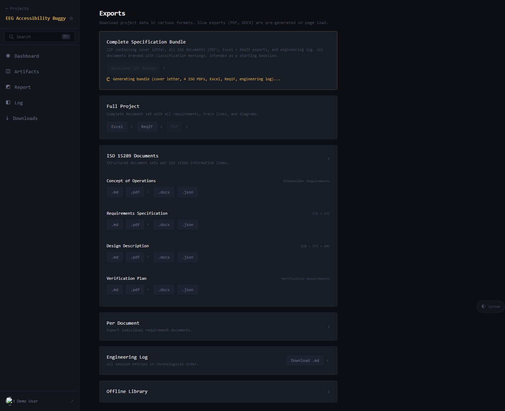

# Exports and document bundles

Derive's per-project Exports page (`/p/<slug>/downloads`, nav-rail
label **Downloads**) is where you turn a project's current state
into deliverable artefacts: a starter ZIP, full-project documents,
ISO 15289 information items, per-document exports, an engineering
log, and an offline library.

This guide walks through what each export contains, when to use
which, and what's pre-generated versus on-demand.

> **Prerequisites:** access to a Derive project. The page works
> for read-only / demo users — the screenshots in this guide were
> taken against `derive.airgen.studio/demo`.

The page header is the h1 `Exports` with the subtitle:

> *"Download project data in various formats. Slow exports (PDF,
> DOCX) are pre-generated on page load."*

PDF and DOCX renders take a few seconds; the page kicks them off
in the background as soon as you arrive. Buttons appear greyed out
until their underlying file is ready, then become clickable. ZIP
bundles are similarly pre-generated — a "Generating bundle…"
status line appears under the bundle button until it's ready.

Each download button has a sibling `↓` "Save for offline" button.
"Save for offline" stores the artefact in the PWA's offline cache
so you can re-open it without re-fetching — useful before a flight
or a flaky-network site visit.

## Complete Specification Bundle

A single ZIP that contains everything a regulator or customer
typically needs:

- A cover letter
- All four ISO 15289 documents as PDF
- Excel and ReqIF exports of the requirements
- The engineering log (markdown)

All documents are branded with classification markings. The card
describes this as *"Intended as a starting baseline"* — this is
the export to grab when you want one file that captures the whole
project at this moment.

Pre-generated on page load. Watch for the "Generating bundle…"
status line; when it disappears the button is ready.

## Full Project

The whole project as a single document, in three formats:

- **Excel** — all requirements as a tabular workbook.
- **ReqIF** — the standard interchange format for moving
  requirements to other tools (DOORS, Polarion, Jama, …).
- **PDF** — a single PDF of the full document set, formatted for
  print or archive.

Pick **Excel** when a reviewer wants spreadsheet ergonomics; pick
**ReqIF** when an external tool is consuming the data; pick **PDF**
for delivery or archive.

## ISO 15289 Documents

ISO 15289 lists the information items a system-life-cycle process
should produce. Derive packages each item as a standalone document
in four formats: `.md`, `.pdf`, `.docx`, `.json`. Four documents:

| Document                    | Content                                  |
| --------------------------- | ---------------------------------------- |
| Concept of Operations       | Stakeholder requirements                 |
| Requirements Specification  | STK + SYS — stakeholder + system requirements |
| Design Description          | SUB + IFC + ARC — subsystem, interface, architecture-decision requirements |
| Verification Plan           | Verification requirements                |

Pick by audience:

- **`.md`** — for git-tracked documentation pipelines or markdown-aware
  tools. The smallest, most diffable form.
- **`.pdf`** — for formal delivery and audit packs.
- **`.docx`** — when the recipient wants editable Word.
- **`.json`** — when downstream tooling needs to parse the document
  programmatically.

## Per Document

A collapsible section that exposes individual requirement documents
for export. Use when you only need one document (e.g., just the
architecture decisions, or just the interface requirements) rather
than the whole ISO bundle.

The visible documents in this section reflect what the project
actually has — for the demo project they include
`architecture-decisions`, `interface-requirements`, `stakeholder-requirements`,
`subsystem-requirements`, `system-requirements`, and
`verification-requirements`.

## Engineering Log

A single `.md` of all session entries in chronological order — the
same content as the Log view, but as one downloadable file. Useful
for auditing, narrative archives, or feeding into other tools.

## Offline Library

A collapsible section listing items already saved for offline via
the `↓` buttons elsewhere on the page. Open it to see what's in
your local PWA cache and to re-open or remove cached items.

If you've never used "Save for offline", this section will be
empty.

## Choosing the right export

A few patterns that come up:

- **Customer / regulator delivery.** Complete Specification
  Bundle (ZIP). Single artefact, branded, contains everything.
- **Tool-to-tool migration.** Full Project → ReqIF, plus the
  individual JSON documents from ISO 15289 if the receiving tool
  needs them.
- **Internal review on a single document.** Per Document, pick
  the document, choose `.md` for diff-friendly review or `.docx`
  if your reviewer marks up Word.
- **Archive snapshot.** Full Project → PDF, or the Complete
  Specification Bundle. PDFs are the canonical archival format
  for most regulated industries.
- **Audit trail of harness activity.** Engineering Log `.md`.
- **Read on the plane.** Save your bundle of choice for offline,
  then access via the Offline Library section.

## Notes on baselines

Derive's exports reflect the project's **current state** — there
is no UI affordance to export against a specific previous baseline
from this page. The card subtitles use the word "baseline"
informally (the Complete Specification Bundle is described as a
"starting baseline") rather than as a versioned artefact.

For versioned snapshots and diffs, refer to the AIRGen-side
tooling (CLI, `airgen` commands).

## What's next

- [Reading the per-project dashboard](./reading-the-per-project-dashboard.md)
- [The Quality Gates view](./the-quality-view.md)
- [Driving the autonomous loop](./driving-the-autonomous-loop.md)
